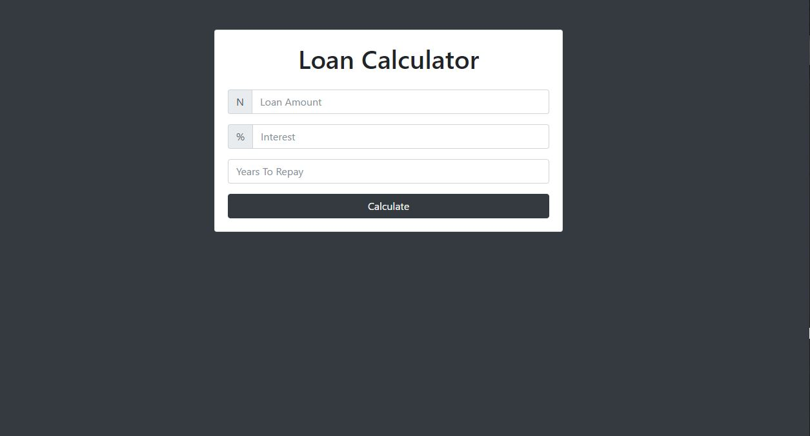
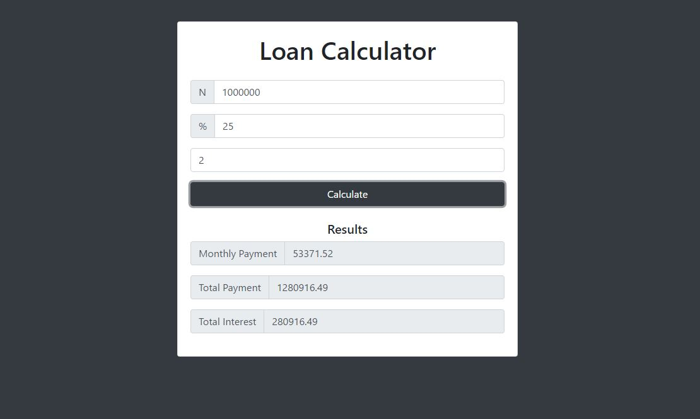

# Loan-Calculator
This is a simple app that enables you calculate profits from any loan amount entered by you and also the rate and year(s) it takes to repay. The project is implemented using Bootstrap 4 for the UI design while the logic has been written in pure javascript. No frameworks used or required.

There isnt much required for the setup, just download to your local machine and open in your browser

<strong>This is what it looks like initially</strong>

<strong>In action</strong>

Voila!